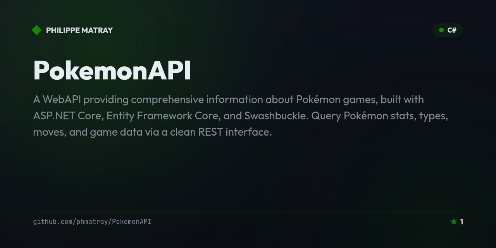

# PokemonAPI — Pokémon REST API in ASP.NET Core

<!-- portfolio-badges:start -->
<!-- Identity -->
[](https://github.com/phmatray/PokemonAPI)

[](https://github.com/phmatray/PokemonAPI/stargazers)
[](https://github.com/phmatray/PokemonAPI/network/members)
[](https://github.com/phmatray/PokemonAPI/blob/HEAD/LICENSE)

<!-- Activity -->
[](https://github.com/phmatray/PokemonAPI/issues)
[](https://github.com/phmatray/PokemonAPI/pulls)
[](https://github.com/phmatray/PokemonAPI/commits)
<!-- portfolio-badges:end -->

<!-- portfolio-toc:start -->

## Table of Contents

- [✨ Features](#-features)
- [📦 Installation](#-installation)
- [🚀 Quick Start](#-quick-start)
- [Usage](#usage)
- [📄 License](#-license)
- [Roadmap](#roadmap)
- [Contributing](#contributing)

<!-- portfolio-toc:end -->


A WebAPI providing comprehensive information about Pokémon games, built with ASP.NET Core, Entity Framework Core, and Swashbuckle. Query Pokémon stats, types, moves, and game data via a clean REST interface.

## ✨ Features
- Full Pokédex data via REST API
- Pokémon stats, types, abilities, and move sets
- Built on the official Veekun Pokémon database
- Swagger/OpenAPI documentation with Swashbuckle
- Entity Framework Core for data access

## 📦 Installation
```bash
git clone https://github.com/phmatray/PokemonAPI
cd PokemonAPI
# Download the database (see README for link)
dotnet run
```

## 🚀 Quick Start
```bash
dotnet run
# API available at: https://localhost:5001
# Swagger UI: https://localhost:5001/swagger
```

```http
GET /api/pokemon/pikachu
GET /api/pokemon?type=electric&limit=10
```

## Usage

Once the API is running (`dotnet run`), query any of the versioned resource controllers, e.g. `PokemonsController` at `api/v1/pokemons`:

```http
GET /api/v1/pokemons/pikachu
```

```json
{
  "id": 25,
  "name": "pikachu",
  "baseExperience": 112,
  "height": 4,
  "weight": 60,
  "isDefault": true,
  "types": [ { "slot": 1, "type": { "name": "electric" } } ],
  "abilities": [ { "isHidden": false, "slot": 1, "ability": { "name": "static" } } ]
}
```

List endpoints support paging and return HATEOAS-style `previous`/`next` links, mirroring the PokéAPI shape:

```http
GET /api/v1/pokemons?limit=20&offset=0
```

<!-- portfolio-techstack:start -->

## Tech Stack

- **C#**

<!-- portfolio-techstack:end -->

## 📄 License
MIT — see LICENSE

---

## Roadmap

- [ ] Publish the Veekun database download/import as an automated setup script instead of a manual step
- [ ] Add response caching / rate limiting for the public read-only endpoints
- [ ] Expand automated test coverage across the resource controllers
- [ ] Containerize the API and database for one-command local startup
- [ ] Add GraphQL as an alternative to the REST surface

See the [open issues](https://github.com/phmatray/PokemonAPI/issues) for the full list of proposed features and known issues.

<!-- portfolio-sections:start -->

## Contributing

Contributions are welcome. Open an issue first to discuss any significant change.

1. Fork the repository and create your branch (`git checkout -b feat/my-feature`)
2. Commit your changes (`git commit -m 'feat: ...'`)
3. Push the branch and open a Pull Request

<!-- portfolio-sections:end -->
